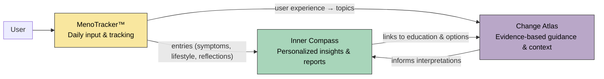
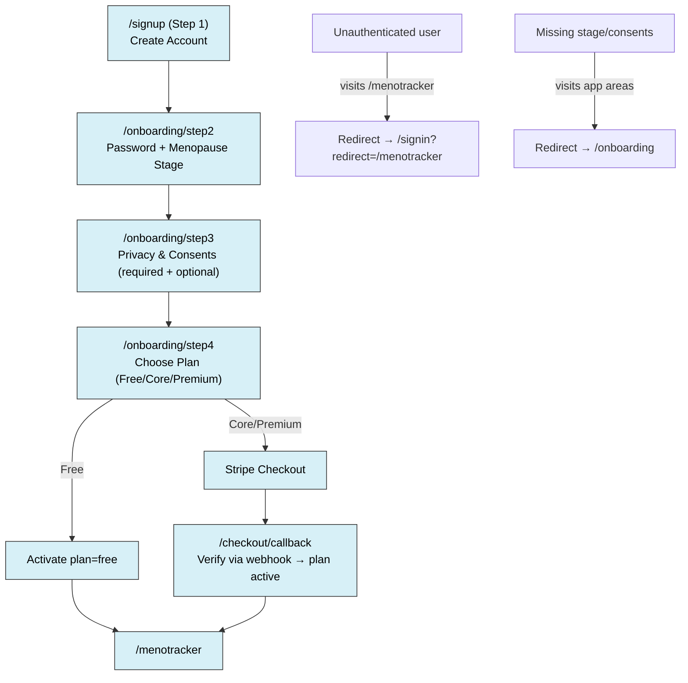
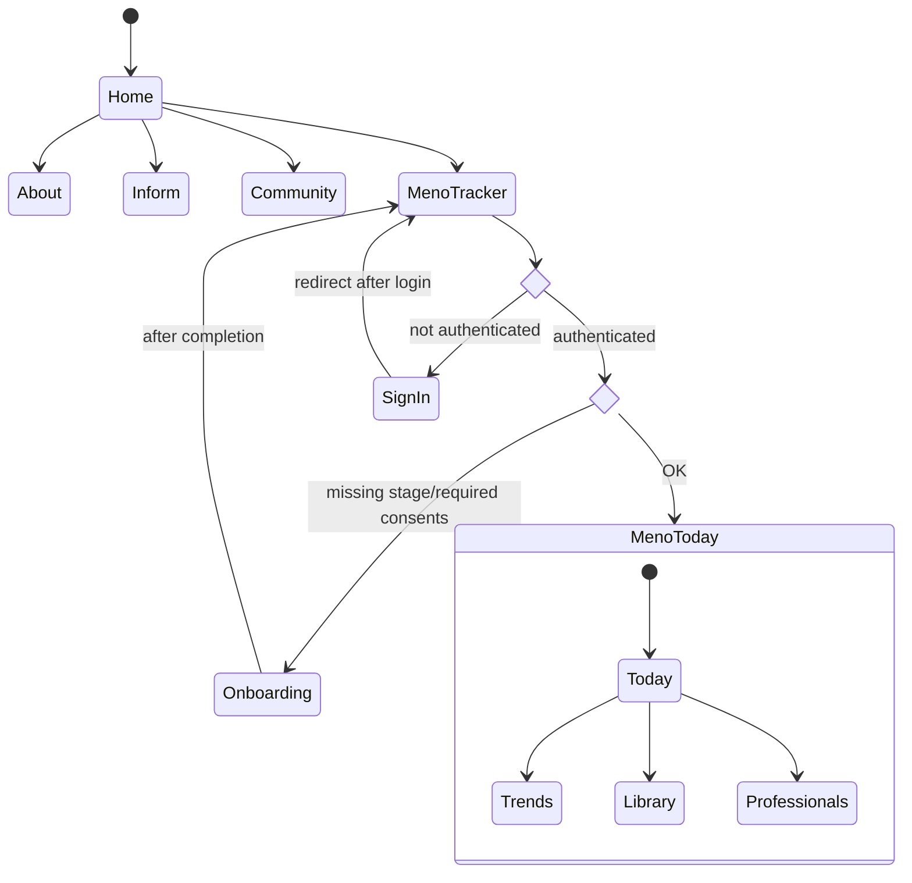
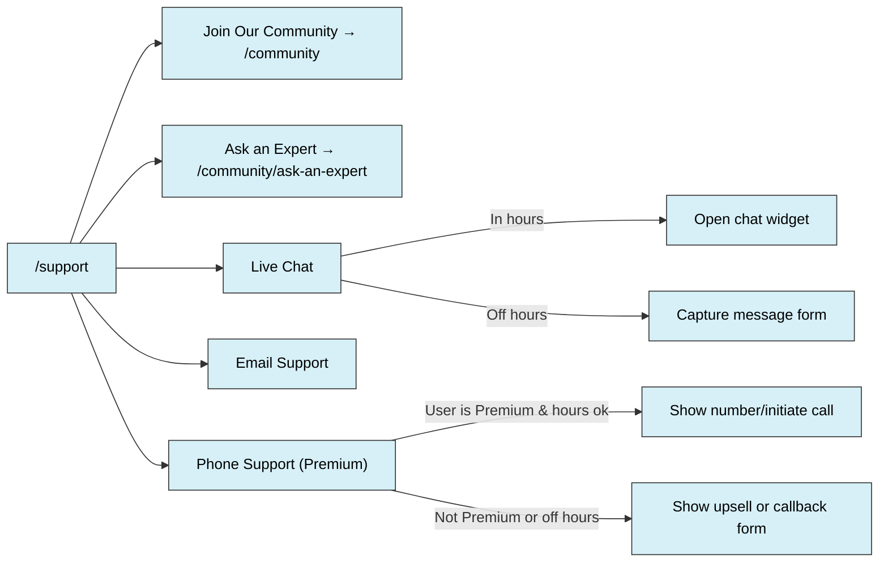
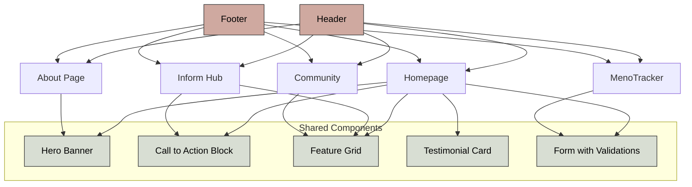
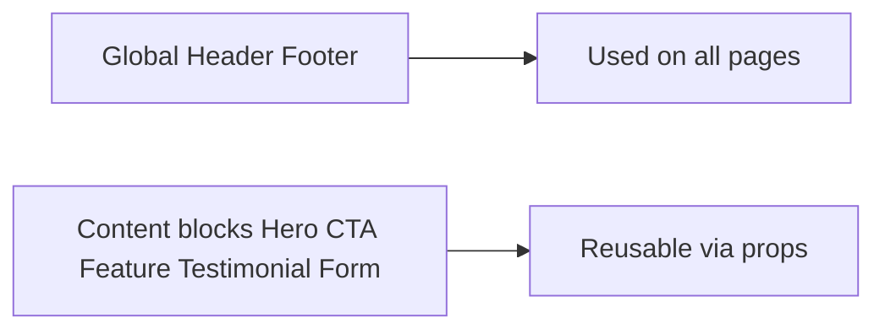

# I Embrace Change – System Architecture & Flows

This document collects core ecosystem, flow, and design system diagrams using **Mermaid** syntax.  

***

## 1. Ecosystem – “Map & Mirror” Model
MenoTracker (input) → Inner Compass (personalized insights) → Change Atlas (evidence library).

***

## 2. Signup & Onboarding Flow
Covers Step 1–4 with guards for authentication and consent.

***

## 3. Page Routing & Guards
Global app routes with authentication + consent checks.

***

## 4. Support Page Logic
Membership gating + office hours logic for chat & phone support.

***

## 5. Component Map – UX Design System
Reusable components defined once, referenced across pages.

***

## 6. Legend (Component Map)

